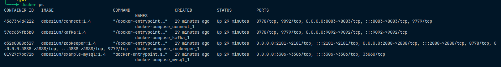
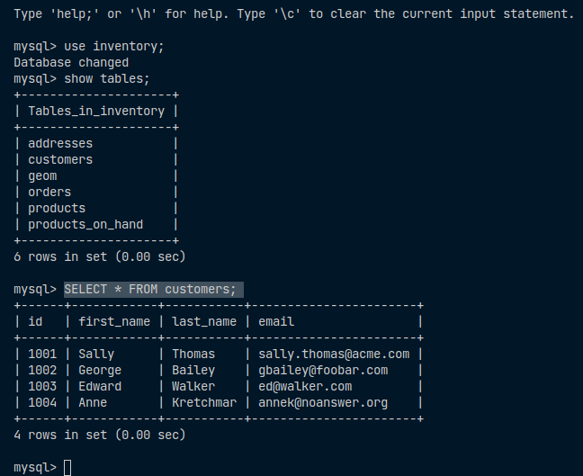
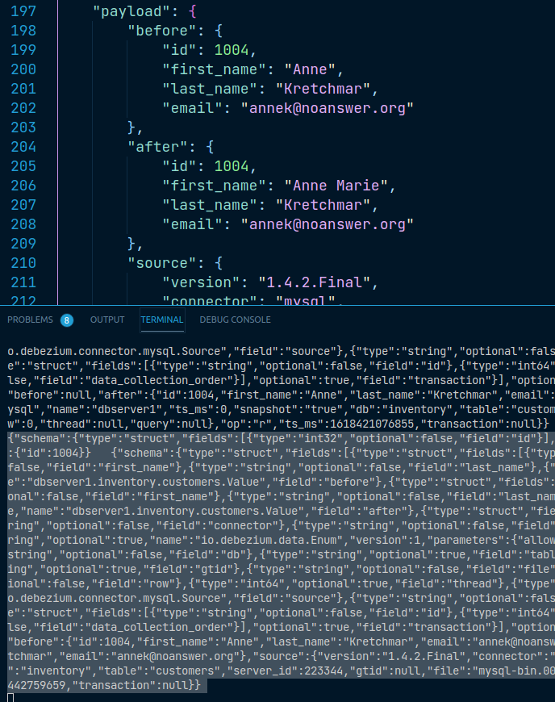

# Monitoreo de Base de Datos MySQL con Debezium

En este tutorial, iniciará los servicios de Debezium, ejecutará un servidor de base de datos MySQL con una base de datos de ejemplo simple y utilizará Debezium para monitorear la base de datos en busca de cambios.

## Herramientas

### Debezium

> Debezium es una plataforma distribuida que convierte sus bases de datos existentes en flujos de eventos, para que las aplicaciones puedan ver y responder de inmediato a cada cambio de nivel de fila en las bases de datos.

### Apicurio Registry

Epicurio Registry es una implementacion de Esquema de Registro la cual actua como una API de Codigo Abierto, ademas de proporcionar bibliotecas cliente y una excelente integracion con Apache Kafka y Kafka Connect en forma de serializadores y convertidores. [Apicurio](https://github.com/Apicurio/apicurio-registry)

## Consideraciones

Puede visualizar los logs de cada contenedor con el siguiente comando: *docker logs --follow --name **container-name***

## Precondiciones

1. Clonar ejemplos de Debezium de su repositorio oficial. [Debezium](https://github.com/debezium/debezium-examples/tree/master)

2. Los servicios necesarios a utilizar en este tutorial son:
    * Zookeper
    * Kafka
    * Base de Datos Mysql
    * Cliente de linea de comandos Mysql
    * Kafka Connect

3. Tener instalado Docker en su maquina

## Usando Mysql

1. Establecer la variable de entorno *DEBEZIUM_VERSION* en su version actual que en nuestro caso es la 1.4
    * *export DEBEZIUM_VERSION=1.5*

2. Inicializar los contenedores de Mysql, Kafka y Zookeper
    * *docker-compose -f ./docker-compose/docker-compose-mysql.yaml up*

Validamos que los servcios se encuentren inicializados

3. Inicializamos el MySQL Connector

> Después de iniciar los servicios Debezium y MySQL, está listo para implementar el conector Debezium MySQL para que pueda comenzar a monitorear la base de datos MySQL de muestra
---
> Al registrar el conector Debezium MySQL, el conector comenzará a monitorear los BinLogs del servidor de base de datos MySQL. La *binlog* registra todas las transacciones de la base de datos (como cambios en filas individuales y cambios en los esquemas). Cuando cambia una fila en la base de datos, Debezium genera un evento de cambio.

     * *curl -i -X POST -H "Accept:application/json" -H  "Content-Type:application/json" <http://localhost:8083/connectors/> -d @register/register-mysql.json*

4. Consumimos mensajes desde un Topico Kafka

> docker-compose -f ./docker-compose/docker-compose-mysql.yaml exec kafka /kafka/bin/kafka-console-consumer.sh \
    --bootstrap-server kafka:9092 \
    --from-beginning \
    --property print.key=true \
    --topic dbserver1.inventory.customers

Ejecutamos
> docker logs --follow **container_id**

5. Procedemos a modificar registros de la Base de Datos Inventory que tenemos en nuestro motor de Base de Datos MySQL

> docker-compose -f ./docker-compose/docker-compose-mysql.yaml exec mysql bash -c 'mysql -u $MYSQL_USER -p$MYSQL_PASSWORD inventory'

Ejecutar los siguiente comandos para validar:
* use inventory;
* show tables;
* SELECT * FROM customers;

6. Continuando el paso 5. Actualizamos un registro de la tabla Customer

> UPDATE customers SET first_name='Anne Marie' WHERE id=1004;

7. Validamos la Captura del Cambio llevado a cabo el cual se ve reflejado en el Topico descrito en el paso 4. Observar los agregados *before* , *after* y *op* el cual para actualizacion toma el valor *u*

8. Eliminamos un registro y observamos el cambio

> DELETE FROM addresses WHERE customer_id=1004;
> DELETE FROM customers WHERE id=1004;

Observar que el tag *op* es igual a *d*

9. Detener los servicios y destruir los recursos creados

> docker-compose -f docker-compose-mysql.yaml down
